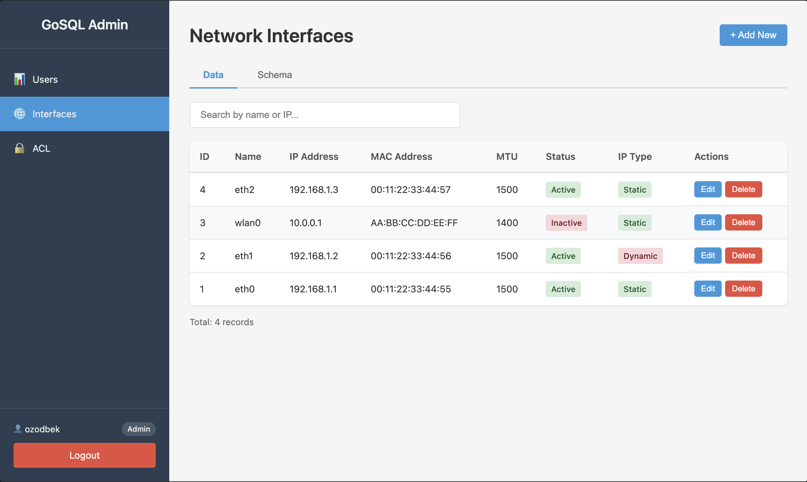
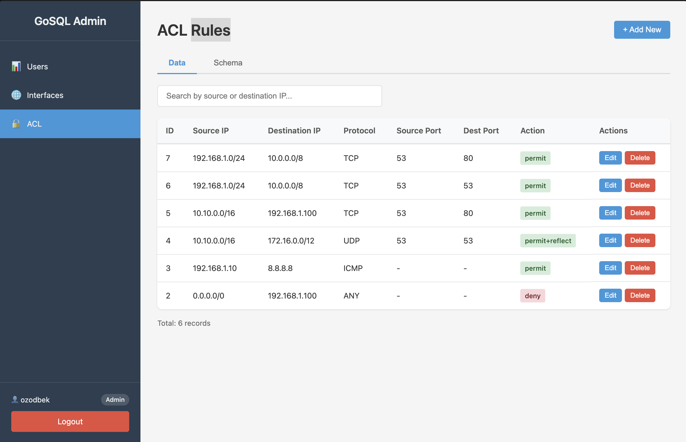
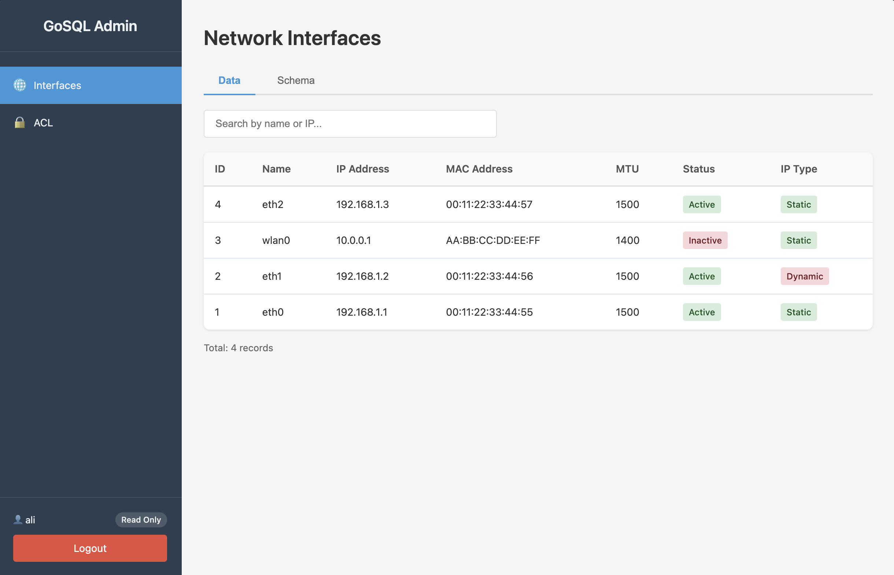

# GoSQL Interface

A web-based admin panel built with Go and PostgreSQL for managing users, network interfaces, and ACL rules. The project is designed as a practical learning platform for database connectivity, authentication, CRUD workflows, and schema inspection in a clean browser-based interface.

## Overview

GoSQL Interface provides a complete admin dashboard for working with relational data from the browser. It includes authenticated access, role-based permissions, searchable tables, modal-based create and edit flows, and a schema viewer for quickly understanding the database structure. The application follows a simple server-rendered architecture with a small JavaScript layer for dynamic interactions.

## Requirements

- Go 1.20+
- PostgreSQL 14+

## Installation

1. Navigate to project directory:
```bash
cd /Users/ozodbek/projects/GoSQL_interface
```

2. Install Go dependencies:
```bash
go mod tidy
```

3. Create database:
```bash
createdb -U ozodbek gosql_db
```

4. Configure environment:
```bash
cp .env.example .env
```

5. Run the application:
```bash
go run cmd/server/main.go
```

6. Open in browser:
```
http://localhost:8080/login
```

## Default Credentials

- **Username**: admin
- **Password**: admin123

## Features

-  User management (CRUD)
-  Network interfaces management (CRUD)
-  ACL rules management (CRUD)
-  Search functionality
-  Password security (bcrypt)
-  Session authentication
-  Database schema viewer

## Screenshots

### Admin Interfaces



### Admin Rules



### Read Only Interfaces



## Tech Stack

- **Backend**: Go 1.26 with the Gin framework. Go handles the HTTP API, page rendering, database access, and business logic. Gin provides fast routing, middleware support, and a lightweight structure for building web services.
- **Database**: PostgreSQL 14. The application stores users, interfaces, and ACL records in PostgreSQL, using SQL migrations to create and seed the schema in a controlled way.
- **Frontend**: HTML templates, Vanilla JavaScript, and CSS. Server-side templates render the pages, while JavaScript handles table loading, search, modals, schema fetching, and form submission without a heavy frontend framework.
- **Authentication**: Session cookies and bcrypt. Sessions keep users logged in securely, and bcrypt hashes passwords before storage so credentials are never saved in plain text.
- **Migrations**: SQL migration files. Database structure changes are versioned and applied from the `migrations/` directory, which keeps setup repeatable across environments.
- **Security**: Role-based access control. Admin users can create, update, and delete records, while standard authenticated users get read-only access to the main data screens.

## Project Structure

```
GoSQL_interface/
├── cmd/server/main.go              # Application entry point
├── internal/
│   ├── config/                     # Configuration
│   ├── database/                   # DB connection & migrations
│   ├── models/                     # Data models (User, Interface, ACL)
│   ├── handlers/                   # HTTP handlers
│   ├── middleware/                 # Auth middleware
│   └── utils/                      # Utilities (password hashing)
├── migrations/                     # SQL migration files
├── web/
│   ├── templates/                  # HTML templates
│   └── static/                     # CSS & JavaScript
└── .env                           # Configuration file
```

## License

MIT
